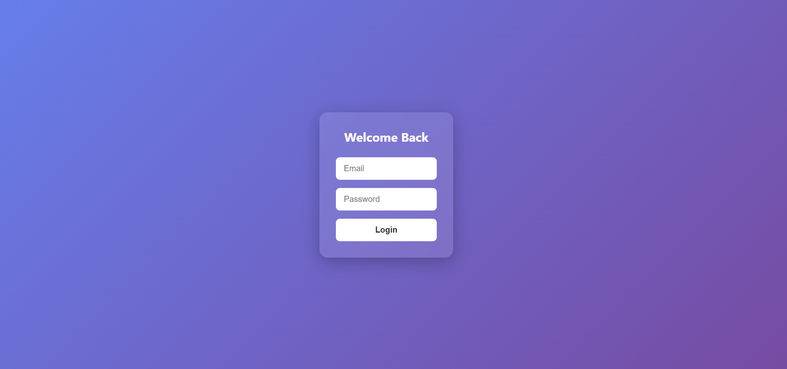

# Responsive Login Form with Animation 

A beautiful and fully responsive login form created using HTML and CSS. Includes smooth animations, modern UI, and clean structure – suitable for all screen sizes.

## ✨ Features

- 🔒 Stylish and functional login form  
- 📱 Fully responsive design (mobile + desktop)  
- 🎨 Smooth CSS animations  
- 🧠 Clean and readable HTML/CSS code

## 📸 Preview

## 📁 Folder Structure

responsive-login-form/  
├── index.html  
├── style.css  
├── preview.png

## 🚀 How to Use

1. Download or clone the repository  
2. Open `index.html` in your browser  
3. You’re good to go!

## 👨‍💻 Author

Built as a part of learning and frontend practice by **ArmaanWorks**  
Feel free to use and modify this for your own projects.

## 📄 License

This project is open-source and free to use under the [MIT License](https://opensource.org/licenses/MIT).